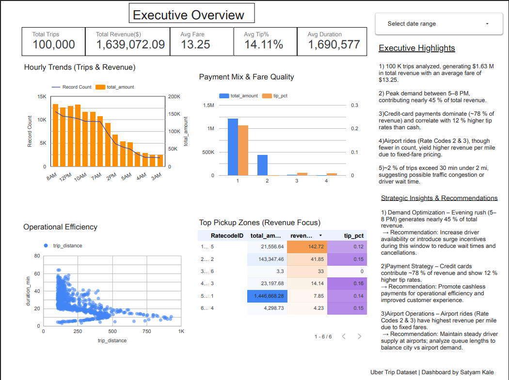

# 🚕 Uber Data Engineering & Analytics Project

## 🏗️ Architecture


### Tech Stack
- Google Cloud Storage (data lake)
- Google Compute Engine (Mage ETL)
- Python & Pandas
- BigQuery (data warehouse)
- Looker Studio (BI dashboard)
- GitHub (version control)

### Workflow
Raw data → Mage ETL → BigQuery (star schema) → Looker Studio dashboard.

## 📊 Dashboard

> [View Live Dashboard](<[your-Looker-Studio-link](https://lookerstudio.google.com/reporting/a40fec90-8aaa-44da-9fbd-abc078db754d)>)

### Key Insights
- 100 K trips analyzed, $1.63 M revenue.
- Peak demand 5–8 PM (≈ 45 % of revenue).
- Credit cards = 78 % of revenue; +12 % tip vs cash.
- Airport trips → highest revenue / mile.
- 2 % slow short trips (< 2 mi, > 30 min) → possible congestion.

### Learning Outcomes
- Built ELT pipeline on GCP with Mage → BigQuery → Looker.
- Modeled fact/dim tables (star schema).
- Created KPIs and anomaly detection.
- Automated data flow for BI consumption.

---

## ⚙️ Run Locally
```bash
pip install -r requirements.txt
python mage-files/extract.py
python mage-files/transform.py
python mage-files/load.py
```
